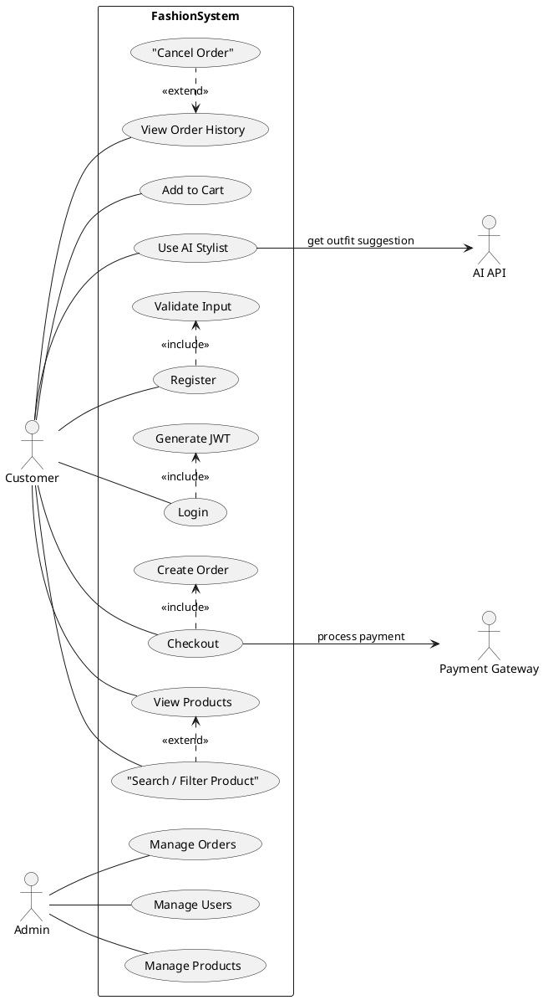
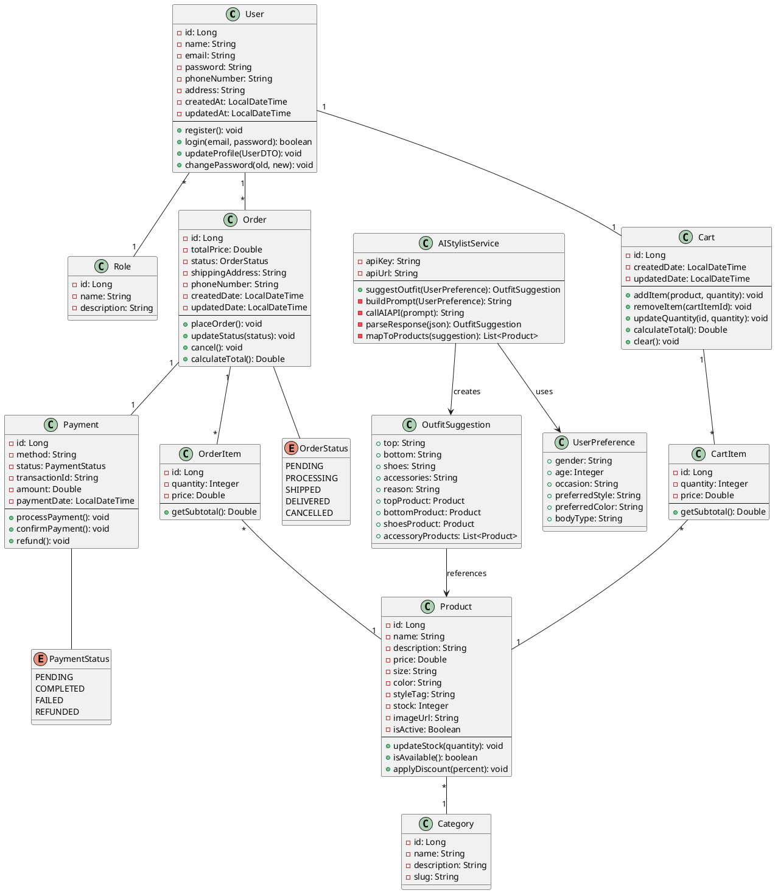
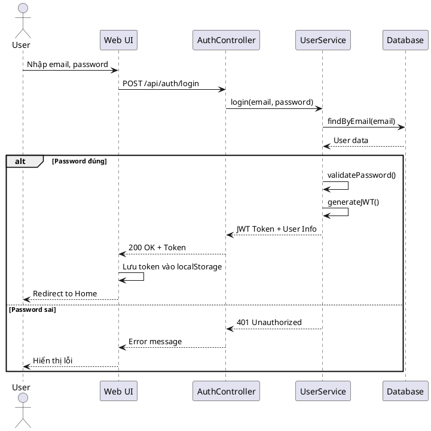

# BÁO CÁO THIẾT KẾ HỆ THỐNG
## Hệ Thống Web App Kinh Doanh Thời Trang Tích Hợp AI Stylist


# 1. TỔNG QUAN HỆ THỐNG

## 1.1. Giới Thiệu

Hệ thống web thương mại điện tử chuyên về kinh doanh thời trang, tích hợp công nghệ AI để đưa ra gợi ý phối đồ thông minh cho khách hàng, giúp nâng cao trải nghiệm mua sắm và tăng tỷ lệ chuyển đổi.

## 1.2. Mục Tiêu Hệ Thống

- **Quản lý sản phẩm thời trang** hiệu quả với đầy đủ thông tin chi tiết
- **Trải nghiệm mua sắm** mượt mà với giỏ hàng và thanh toán online
- **AI Stylist** - Gợi ý outfit thông minh dựa trên sở thích và thông tin người dùng
- **Quản trị hệ thống** toàn diện cho Admin

## 1.3. Đối Tượng Người Dùng

### Customer (Khách hàng)
- Đăng ký/Đăng nhập tài khoản
- Xem, tìm kiếm và lọc sản phẩm
- Thêm sản phẩm vào giỏ hàng
- Thanh toán online
- Xem lịch sử đơn hàng
- Sử dụng AI Stylist để nhận gợi ý phối đồ

### Admin (Quản trị viên)
- Quản lý sản phẩm (CRUD)
- Quản lý đơn hàng
- Quản lý người dùng
- Thống kê báo cáo

### AI API (External System)
- Nhận thông tin từ hệ thống
- Phân tích và đưa ra gợi ý outfit
- Trả về kết quả dưới dạng JSON

## 1.4. Công Nghệ Sử Dụng

### Tech Stack
- **Frontend**: React.js 18.x / Vue.js 3.x
- **Backend**: Spring Boot 3.x (Java)
- **Database**: MySQL 8.x / PostgreSQL
- **AI Integration**: OpenAI API / Custom AI Service
- **Payment**: VNPay / MoMo / Stripe
- **Cache**: Redis
- **Build Tools**: Maven/Gradle, Vite/Webpack

### Kiến trúc
```
Frontend (React/Vue) ↔ Backend API (Spring Boot) ↔ Database (MySQL)
                              ↓
                    External Services (AI API, Payment Gateway)
```

## 1.5. Tính Năng Chính

### E-commerce Core
- Quản lý sản phẩm với phân loại chi tiết (size, màu sắc, style)
- Giỏ hàng thông minh
- Thanh toán online đa dạng
- Quản lý đơn hàng
- Lịch sử mua hàng

### AI Features
- **AI Stylist** - Gợi ý phối đồ dựa trên:
  - Thông tin cá nhân (tuổi, giới tính, phong cách)
  - Dịp sử dụng
  - Sở thích màu sắc
- Giải thích lý do gợi ý
- Link trực tiếp đến sản phẩm

---

# 2. USE CASE DIAGRAM

## 2.1. Actors (Tác nhân)

### Customer (Khách hàng)
Người dùng cuối sử dụng hệ thống để mua sắm thời trang và nhận gợi ý phối đồ từ AI.

### Admin (Quản trị viên)
Người quản trị hệ thống, chịu trách nhiệm quản lý sản phẩm, đơn hàng và người dùng.

### AI API (External System)
Hệ thống AI bên ngoài cung cấp dịch vụ gợi ý phối đồ thông minh.

### Payment Gateway (External System)
Cổng thanh toán bên thứ ba xử lý các giao dịch thanh toán online.

## 2.2. Use Cases

### Customer Use Cases

#### UC-01: Register (Đăng ký)
- **Mô tả**: Khách hàng tạo tài khoản mới
- **Input**: Tên, email, mật khẩu
- **Output**: Tài khoản được tạo thành công
- **Quy trình**:
  1. Nhập thông tin đăng ký
  2. Validate dữ liệu (email duy nhất, mật khẩu mạnh)
  3. Mã hóa mật khẩu
  4. Lưu vào database

#### UC-02: Login (Đăng nhập)
- **Mô tả**: Đăng nhập vào hệ thống
- **Input**: Email, mật khẩu
- **Output**: JWT Token, thông tin người dùng

#### UC-03: View Products (Xem sản phẩm)
- **Mô tả**: Xem danh sách sản phẩm
- **Output**: Danh sách sản phẩm với thông tin: tên, giá, hình ảnh, size, màu

#### UC-04: Search / Filter Products (Tìm kiếm / Lọc sản phẩm)
- **Mô tả**: Tìm kiếm và lọc sản phẩm theo nhiều tiêu chí
- **Input**: Từ khóa, danh mục, khoảng giá, size, màu sắc, style tag
- **Output**: Danh sách sản phẩm phù hợp

#### UC-05: Add to Cart (Thêm vào giỏ hàng)
- **Mô tả**: Thêm sản phẩm vào giỏ hàng
- **Input**: Product ID, số lượng
- **Output**: Sản phẩm được thêm vào cart
- **Business Rules**: Kiểm tra tồn kho, giới hạn số lượng tối đa

#### UC-06: Checkout (Thanh toán)
- **Mô tả**: Thanh toán đơn hàng
- **Input**: Thông tin giao hàng, phương thức thanh toán
- **Output**: Đơn hàng được tạo
- **Actors**: Customer, Payment Gateway

#### UC-07: View Order History (Xem lịch sử đơn hàng)
- **Mô tả**: Xem danh sách đơn hàng đã đặt
- **Output**: Danh sách đơn hàng với trạng thái: Pending, Processing, Shipped, Delivered, Cancelled

#### UC-08: Use AI Stylist (Sử dụng AI Stylist) [TÍNH NĂNG NỔI BẬT]
- **Mô tả**: Nhận gợi ý phối đồ từ AI
- **Input**: Giới tính, độ tuổi, phong cách ưa thích, dịp sử dụng, màu sắc yêu thích
- **Output**: Outfit suggestion (áo, quần, giày, phụ kiện), lý do gợi ý, link đến sản phẩm
- **Actors**: Customer, AI API

### Admin Use Cases

#### UC-09: Manage Products (Quản lý sản phẩm)
- Thêm sản phẩm mới
- Sửa thông tin sản phẩm
- Xóa sản phẩm
- Cập nhật tồn kho

#### UC-10: Manage Orders (Quản lý đơn hàng)
- Xem danh sách đơn hàng
- Cập nhật trạng thái đơn hàng
- Xem chi tiết đơn hàng
- Hủy đơn hàng

#### UC-11: Manage Users (Quản lý người dùng)
- Xem danh sách người dùng
- Khóa/Mở khóa tài khoản
- Phân quyền
- Xem lịch sử hoạt động

## 2.3. PlantUML Code



## 2.4. Use Case Priority

### High Priority (Phase 1)
- UC-02: Login
- UC-03: View Products
- UC-04: Search / Filter Products
- UC-05: Add to Cart
- UC-06: Checkout
- UC-09: Manage Products

### Medium Priority (Phase 2)
- UC-01: Register
- UC-07: View Order History
- UC-08: Use AI Stylist
- UC-10: Manage Orders

### Low Priority (Phase 3)
- UC-11: Manage Users
- Advanced filtering
- Statistics & Reports

---

# 3. CLASS DIAGRAM

## 3.1. Tổng Quan

Class Diagram mô tả cấu trúc các lớp trong hệ thống, bao gồm các thuộc tính, phương thức và mối quan hệ giữa chúng.

## 3.2. Nhóm Class

### Nhóm 1: User & Authentication
### Nhóm 2: Product & Category
### Nhóm 3: Shopping Cart
### Nhóm 4: Order & Payment
### Nhóm 5: AI Module

## 3.3. Chi Tiết Các Class

### User & Authentication

#### Class: User
```java
@Entity
@Table(name = "users")
public class User {
    private Long id;
    private String name;
    private String email;
    private String password;
    private String phoneNumber;
    private String address;
    private Role role;
    private LocalDateTime createdAt;
    private LocalDateTime updatedAt;
    
    public void register();
    public boolean login(String email, String password);
    public void updateProfile(UserDTO userDTO);
    public void changePassword(String oldPassword, String newPassword);
}
```

**Thuộc tính:**
- `id`: Long - ID duy nhất
- `name`: String - Tên người dùng
- `email`: String - Email (unique)
- `password`: String - Mật khẩu đã mã hóa (BCrypt)
- `phoneNumber`: String - Số điện thoại
- `address`: String - Địa chỉ
- `role`: Role - Quyền (CUSTOMER/ADMIN)
- `createdAt`: LocalDateTime - Ngày tạo
- `updatedAt`: LocalDateTime - Ngày cập nhật

#### Class: Role
```java
@Entity
@Table(name = "roles")
public class Role {
    private Long id;
    private String name; // CUSTOMER, ADMIN
    private String description;
}
```

**Relationship**: User N:1 Role (Many users have one role)

### Product & Category

#### Class: Product
```java
@Entity
@Table(name = "products")
public class Product {
    private Long id;
    private String name;
    private String description;
    private Double price;
    private String size;
    private String color;
    private String styleTag;
    private Integer stock;
    private String imageUrl;
    private Category category;
    private LocalDateTime createdAt;
    private LocalDateTime updatedAt;
    private Boolean isActive;
    
    public void updateStock(int quantity);
    public boolean isAvailable();
    public void applyDiscount(Double discountPercent);
}
```

#### Class: Category
```java
@Entity
@Table(name = "categories")
public class Category {
    private Long id;
    private String name; // Áo, Quần, Giày, Phụ kiện
    private String description;
    private String slug;
}
```

**Relationship**: Product N:1 Category

### Shopping Cart

#### Class: Cart
```java
@Entity
@Table(name = "carts")
public class Cart {
    private Long id;
    private User user;
    private List<CartItem> items;
    private LocalDateTime createdDate;
    private LocalDateTime updatedDate;
    
    public void addItem(Product product, int quantity);
    public void removeItem(Long cartItemId);
    public void updateQuantity(Long cartItemId, int quantity);
    public Double calculateTotal();
    public void clear();
}
```

#### Class: CartItem
```java
@Entity
@Table(name = "cart_items")
public class CartItem {
    private Long id;
    private Cart cart;
    private Product product;
    private Integer quantity;
    private Double price;
    
    public Double getSubtotal();
}
```

**Relationships:**
- Cart 1:N CartItem
- CartItem N:1 Product
- User 1:1 Cart

### Order & Payment

#### Class: Order
```java
@Entity
@Table(name = "orders")
public class Order {
    private Long id;
    private User user;
    private List<OrderItem> items;
    private Double totalPrice;
    private OrderStatus status;
    private String shippingAddress;
    private String phoneNumber;
    private Payment payment;
    private LocalDateTime createdDate;
    private LocalDateTime updatedDate;
    
    public void placeOrder();
    public void updateStatus(OrderStatus status);
    public void cancel();
    public Double calculateTotal();
}
```

#### Class: OrderItem
```java
@Entity
@Table(name = "order_items")
public class OrderItem {
    private Long id;
    private Order order;
    private Product product;
    private Integer quantity;
    private Double price;
    
    public Double getSubtotal();
}
```

#### Enum: OrderStatus
```java
public enum OrderStatus {
    PENDING,      // Chờ xử lý
    PROCESSING,   // Đang xử lý
    SHIPPED,      // Đã gửi hàng
    DELIVERED,    // Đã giao
    CANCELLED     // Đã hủy
}
```

#### Class: Payment
```java
@Entity
@Table(name = "payments")
public class Payment {
    private Long id;
    private Order order;
    private String method; // COD, VNPAY, MOMO, CREDIT_CARD
    private PaymentStatus status;
    private String transactionId;
    private Double amount;
    private LocalDateTime paymentDate;
    
    public void processPayment();
    public void confirmPayment();
    public void refund();
}
```

#### Enum: PaymentStatus
```java
public enum PaymentStatus {
    PENDING,
    COMPLETED,
    FAILED,
    REFUNDED
}
```

**Relationships:**
- User 1:N Order
- Order 1:N OrderItem
- OrderItem N:1 Product
- Order 1:1 Payment

### AI Module

#### Class: AIStylistService
```java
@Service
public class AIStylistService {
    private String apiKey;
    private String apiUrl;
    
    public OutfitSuggestion suggestOutfit(UserPreference userPreference);
    private String buildPrompt(UserPreference userPreference);
    private String callAIAPI(String prompt);
    private OutfitSuggestion parseResponse(String jsonResponse);
    private List<Product> mapToProducts(OutfitSuggestion suggestion);
}
```

#### Class: UserPreference (DTO)
```java
public class UserPreference {
    private String gender;          // Nam/Nữ
    private Integer age;            // Tuổi
    private String occasion;        // Dịp (work, party, casual, sport)
    private String preferredStyle;  // Style yêu thích
    private String preferredColor;  // Màu ưa thích
    private String bodyType;        // Dáng người (optional)
}
```

#### Class: OutfitSuggestion (DTO)
```java
public class OutfitSuggestion {
    private String top;         // Áo
    private String bottom;      // Quần/Váy
    private String shoes;       // Giày
    private String accessories; // Phụ kiện
    private String reason;      // Lý do gợi ý
    
    private Product topProduct;
    private Product bottomProduct;
    private Product shoesProduct;
    private List<Product> accessoryProducts;
}
```

## 3.4. PlantUML Code



## 3.5. Relationships Summary

| Quan hệ | Mô tả | Cardinality |
|---------|-------|-------------|
| User - Role | User có một Role | N:1 |
| User - Cart | Mỗi User có một Cart | 1:1 |
| User - Order | User có nhiều Order | 1:N |
| Product - Category | Product thuộc một Category | N:1 |
| Cart - CartItem | Cart chứa nhiều CartItem | 1:N |
| CartItem - Product | CartItem tham chiếu Product | N:1 |
| Order - OrderItem | Order chứa nhiều OrderItem | 1:N |
| OrderItem - Product | OrderItem tham chiếu Product | N:1 |
| Order - Payment | Mỗi Order có một Payment | 1:1 |
| OutfitSuggestion - Product | Gợi ý map với Product | N:N |

## 3.6. Database Tables

Từ Class Diagram, ta sẽ có các bảng sau:

1. `users` - Thông tin người dùng
2. `roles` - Vai trò người dùng
3. `categories` - Danh mục sản phẩm
4. `products` - Sản phẩm
5. `carts` - Giỏ hàng
6. `cart_items` - Chi tiết giỏ hàng
7. `orders` - Đơn hàng
8. `order_items` - Chi tiết đơn hàng
9. `payments` - Thanh toán

---

# 4. SEQUENCE DIAGRAM

## 4.1. Tổng Quan

Sequence Diagram mô tả luồng xử lý và tương tác giữa các đối tượng theo trình tự thời gian.

## 4.2. User Login

### Mô tả
Luồng đăng nhập của người dùng vào hệ thống.

### Actors
- Customer/Admin
- Web UI
- Backend API
- Database

### PlantUML Code


### Steps
1. User nhập email và password
2. UI gửi POST request đến `/api/auth/login`
3. Backend tìm user theo email
4. Validate password (BCrypt)
5. Nếu đúng: Tạo JWT token và trả về
6. Nếu sai: Trả về 401 Unauthorized
7. UI lưu token và redirect đến trang chủ

## 4.3. AI Stylist Suggestion [TÍNH NĂNG NỔI BẬT]

### Mô tả
Luồng sử dụng AI để gợi ý phối đồ - Tính năng nổi bật của hệ thống.

### Key Components

#### Request DTO
```json
{
  "gender": "male",
  "age": 25,
  "occasion": "work",
  "preferredStyle": "smart-casual",
  "preferredColor": "navy, white"
}
```

#### AI Prompt Template
```
Bạn là một fashion stylist chuyên nghiệp. 
Hãy gợi ý outfit hoàn chỉnh cho:
- Giới tính: {gender}
- Tuổi: {age}
- Dịp: {occasion}
- Phong cách yêu thích: {preferredStyle}
- Màu sắc yêu thích: {preferredColor}

Trả về JSON format:
{
  "top": "tên áo",
  "bottom": "tên quần/váy",
  "shoes": "tên giày",
  "accessories": "phụ kiện",
  "reason": "lý do gợi ý này"
}
```

#### Response DTO
```json
{
  "outfit": {
    "top": {
      "suggestion": "Áo sơ mi trắng",
      "product": {
        "id": 123,
        "name": "Áo sơ mi Oxford trắng",
        "price": 450000,
        "imageUrl": "..."
      }
    },
    "bottom": {
      "suggestion": "Quần tây xanh navy",
      "product": {...}
    },
    "shoes": {...},
    "accessories": [...]
  },
  "reason": "Outfit này phù hợp cho môi trường công sở..."
}
```

### Business Logic
1. **Build Prompt**: Tạo prompt từ user input
2. **Call AI API**: Gửi request đến OpenAI/Custom AI
3. **Parse Response**: Parse JSON từ AI
4. **Product Matching**: 
   - Tìm sản phẩm tương tự trong DB
   - Match theo: category, color, styleTag
   - Sắp xếp theo độ phù hợp
5. **Return Result**: Trả về gợi ý + products

### Error Handling
- AI API timeout → Fallback to default suggestions
- No matching products → Suggest alternative
- Invalid AI response → Retry hoặc show error

## 4.4. Timing Considerations

| Sequence | Average Time | Notes |
|----------|-------------|-------|
| Login | 200-500ms | Include DB query + JWT generation |
| Registration | 300-600ms | Include password encryption |
| Add to Cart | 100-300ms | Fast operation |
| Checkout | 1-3s | Include payment gateway |
| AI Stylist | 3-10s | Depends on AI API response time |
| Admin CRUD | 200-500ms | Standard CRUD operations |

## 4.5. Security Notes

1. **JWT Token**: Expire sau 24h, refresh token sau 30 days
2. **Password**: BCrypt với cost factor = 12
3. **Payment**: Chỉ lưu transaction ID, không lưu card info
4. **AI API**: Rate limiting 10 requests/minute/user
5. **Admin**: Require 2FA cho sensitive operations

---

# 5. ACTIVITY DIAGRAM

## 5.1. Tổng Quan

Activity Diagram mô tả luồng hoạt động của hệ thống, bao gồm các quyết định và xử lý song song.

## 5.2. User Login Flow

### Key Points
- Validate input trước khi gửi request
- Khóa tài khoản sau 5 lần đăng nhập sai
- Sử dụng JWT để duy trì session

## 5.3. Shopping & Checkout Flow

### Decision Points
1. **Stock Check**: Kiểm tra tồn kho trước khi add to cart
2. **Login Check**: Yêu cầu login trước checkout
3. **Payment Method**: Xử lý khác nhau cho COD vs Online Payment
4. **Payment Result**: Xử lý success/failure

## 5.4. AI Stylist Flow 

### Key Features
1. **Parallel Processing**: Tìm kiếm nhiều loại sản phẩm đồng thời
2. **Fallback Handling**: Xử lý khi AI API lỗi
3. **Alternative Suggestions**: Đề xuất khi không tìm được sản phẩm phù hợp
4. **User Feedback Loop**: Cho phép người dùng yêu cầu gợi ý mới

### Business Rules
- AI request timeout: 10 seconds
- Maximum retries: 2 lần
- Cache suggestions: 1 giờ (cho cùng input)
- Rate limit: 10 requests/hour/user


## 5.5. Database Design

### Schema Overview
```sql
-- Users & Authentication
CREATE TABLE roles (
    id BIGINT PRIMARY KEY AUTO_INCREMENT,
    name VARCHAR(50) NOT NULL UNIQUE,
    description VARCHAR(255)
);

CREATE TABLE users (
    id BIGINT PRIMARY KEY AUTO_INCREMENT,
    name VARCHAR(100) NOT NULL,
    email VARCHAR(100) NOT NULL UNIQUE,
    password VARCHAR(255) NOT NULL,
    phone_number VARCHAR(20),
    address TEXT,
    role_id BIGINT,
    created_at TIMESTAMP DEFAULT CURRENT_TIMESTAMP,
    updated_at TIMESTAMP DEFAULT CURRENT_TIMESTAMP ON UPDATE CURRENT_TIMESTAMP,
    FOREIGN KEY (role_id) REFERENCES roles(id)
);

-- Products
CREATE TABLE categories (
    id BIGINT PRIMARY KEY AUTO_INCREMENT,
    name VARCHAR(100) NOT NULL,
    description TEXT,
    slug VARCHAR(100) UNIQUE
);

CREATE TABLE products (
    id BIGINT PRIMARY KEY AUTO_INCREMENT,
    name VARCHAR(255) NOT NULL,
    description TEXT,
    price DECIMAL(10, 2) NOT NULL,
    size VARCHAR(20),
    color VARCHAR(50),
    style_tag VARCHAR(50),
    stock INT DEFAULT 0,
    image_url VARCHAR(500),
    category_id BIGINT,
    is_active BOOLEAN DEFAULT TRUE,
    created_at TIMESTAMP DEFAULT CURRENT_TIMESTAMP,
    updated_at TIMESTAMP DEFAULT CURRENT_TIMESTAMP ON UPDATE CURRENT_TIMESTAMP,
    FOREIGN KEY (category_id) REFERENCES categories(id),
    INDEX idx_category (category_id),
    INDEX idx_price (price),
    INDEX idx_style (style_tag)
);

-- Shopping Cart
CREATE TABLE carts (
    id BIGINT PRIMARY KEY AUTO_INCREMENT,
    user_id BIGINT NOT NULL UNIQUE,
    created_date TIMESTAMP DEFAULT CURRENT_TIMESTAMP,
    updated_date TIMESTAMP DEFAULT CURRENT_TIMESTAMP ON UPDATE CURRENT_TIMESTAMP,
    FOREIGN KEY (user_id) REFERENCES users(id) ON DELETE CASCADE
);

CREATE TABLE cart_items (
    id BIGINT PRIMARY KEY AUTO_INCREMENT,
    cart_id BIGINT NOT NULL,
    product_id BIGINT NOT NULL,
    quantity INT NOT NULL DEFAULT 1,
    price DECIMAL(10, 2) NOT NULL,
    FOREIGN KEY (cart_id) REFERENCES carts(id) ON DELETE CASCADE,
    FOREIGN KEY (product_id) REFERENCES products(id),
    UNIQUE KEY unique_cart_product (cart_id, product_id)
);

-- Orders
CREATE TABLE orders (
    id BIGINT PRIMARY KEY AUTO_INCREMENT,
    user_id BIGINT NOT NULL,
    total_price DECIMAL(10, 2) NOT NULL,
    status VARCHAR(20) NOT NULL,
    shipping_address TEXT NOT NULL,
    phone_number VARCHAR(20) NOT NULL,
    created_date TIMESTAMP DEFAULT CURRENT_TIMESTAMP,
    updated_date TIMESTAMP DEFAULT CURRENT_TIMESTAMP ON UPDATE CURRENT_TIMESTAMP,
    FOREIGN KEY (user_id) REFERENCES users(id),
    INDEX idx_user (user_id),
    INDEX idx_status (status),
    INDEX idx_created (created_date)
);

CREATE TABLE order_items (
    id BIGINT PRIMARY KEY AUTO_INCREMENT,
    order_id BIGINT NOT NULL,
    product_id BIGINT NOT NULL,
    quantity INT NOT NULL,
    price DECIMAL(10, 2) NOT NULL,
    FOREIGN KEY (order_id) REFERENCES orders(id) ON DELETE CASCADE,
    FOREIGN KEY (product_id) REFERENCES products(id)
);

-- Payments
CREATE TABLE payments (
    id BIGINT PRIMARY KEY AUTO_INCREMENT,
    order_id BIGINT NOT NULL UNIQUE,
    method VARCHAR(50) NOT NULL,
    status VARCHAR(20) NOT NULL,
    transaction_id VARCHAR(255),
    amount DECIMAL(10, 2) NOT NULL,
    payment_date TIMESTAMP,
    created_at TIMESTAMP DEFAULT CURRENT_TIMESTAMP,
    FOREIGN KEY (order_id) REFERENCES orders(id)
);
```

### Indexing Strategy
```sql
-- Frequently queried columns
CREATE INDEX idx_products_category ON products(category_id);
CREATE INDEX idx_products_price ON products(price);
CREATE INDEX idx_products_style ON products(style_tag);
CREATE INDEX idx_products_compound ON products(category_id, price, is_active);

-- Search optimization
CREATE FULLTEXT INDEX idx_products_search ON products(name, description);

-- Order queries
CREATE INDEX idx_orders_user_status ON orders(user_id, status);
CREATE INDEX idx_orders_date ON orders(created_date DESC);
```


