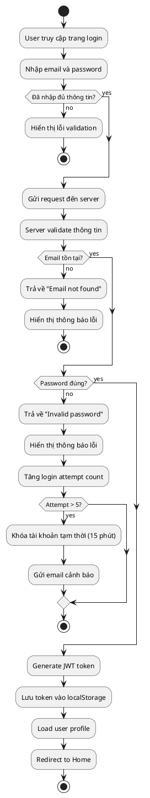
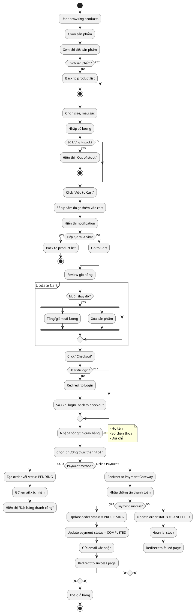
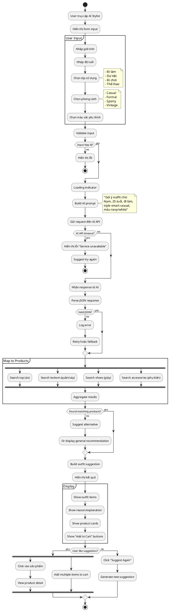
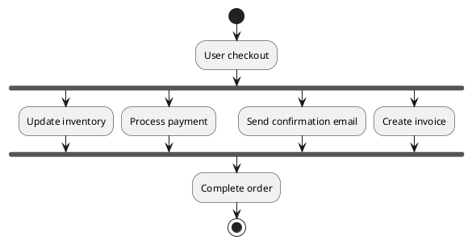
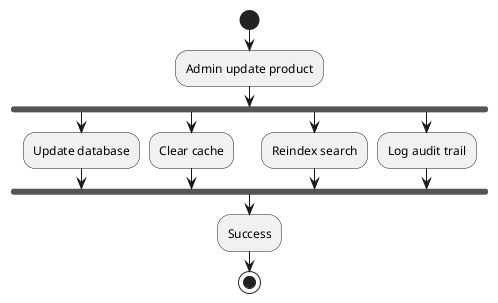

# 🔄 Activity Diagram - Sơ Đồ Hoạt Động

## Tổng Quan

Activity Diagram mô tả luồng hoạt động của hệ thống, bao gồm các quyết định và xử lý song song.

## 📋 Danh Sách Activity Diagrams

1. [🔐 User Login Flow](#1-user-login-flow)
2. [🛒 Shopping & Checkout Flow](#2-shopping--checkout-flow)
3. [🤖 AI Stylist Flow](#3-ai-stylist-flow) ⭐
4. [📦 Order Processing Flow (Admin)](#4-order-processing-flow-admin)
5. [🔍 Product Search & Filter Flow](#5-product-search--filter-flow)

---

## 1️⃣ User Login Flow

### PlantUML Code


### Key Points
- Validate input trước khi gửi request
- Khóa tài khoản sau 5 lần đăng nhập sai
- Sử dụng JWT để duy trì session

---

## 2️⃣ Shopping & Checkout Flow

### PlantUML Code


### Decision Points
1. **Stock Check**: Kiểm tra tồn kho trước khi add to cart
2. **Login Check**: Yêu cầu login trước checkout
3. **Payment Method**: Xử lý khác nhau cho COD vs Online Payment
4. **Payment Result**: Xử lý success/failure

---

## 3️⃣ AI Stylist Flow ⭐

### PlantUML Code


### Key Features
1. **Parallel Processing**: Tìm kiếm nhiều loại sản phẩm đồng thời
2. **Fallback Handling**: Xử lý khi AI API lỗi
3. **Alternative Suggestions**: Đề xuất khi không tìm được sản phẩm phù hợp
4. **User Feedback Loop**: Cho phép người dùng yêu cầu gợi ý mới

### Business Rules
- AI request timeout: 10 seconds
- Maximum retries: 2 lần
- Cache suggestions: 1 giờ (cho cùng input)
- Rate limit: 10 requests/hour/user

---

## 4️⃣ Order Processing Flow (Admin)

### PlantUML Code
```plantuml
@startuml

|Admin|
start

:Login to Admin panel;

:View order list;

:Filter orders;
note right
  - By status
  - By date
  - By customer
end note

:Select order to process;

:View order details;

|System|
:Display order info;
note right
  - Customer info
  - Products
  - Total price
  - Payment status
end note

|Admin|
if (Order status?) then (PENDING)
  
  :Verify payment;
  
  if (Payment confirmed?) then (yes)
    :Update status → PROCESSING;
    :Allocate stock;
    :Generate picking list;
  else (no)
    :Contact customer;
    
    if (Customer confirms?) then (yes)
      :Update to PROCESSING;
    else (no)
      :Cancel order;
      :Refund if needed;
      stop
    endif
  endif
  
else (PROCESSING)
  
  :Prepare products;
  :Pack items;
  :Create shipping label;
  :Update status → SHIPPED;
  :Input tracking number;
  
  |System|
  :Send notification to customer;
  :Email tracking info;
  
else (SHIPPED)
  |Admin|
  :Monitor delivery;
  
  if (Delivery confirmed?) then (yes)
    :Update status → DELIVERED;
  else (no - Has issue)
    :Handle customer complaint;
  endif
  
endif

|System|
:Update database;
:Log activity;

stop

@enduml
```

### Admin Actions by Status

| Status | Available Actions |
|--------|------------------|
| PENDING | Confirm payment, Cancel order |
| PROCESSING | Prepare shipment, Update status |
| SHIPPED | Add tracking, Confirm delivery |
| DELIVERED | Handle returns (if any) |
| CANCELLED | View cancellation reason |

---

## 5️⃣ Product Search & Filter Flow

### PlantUML Code
```plantuml
@startuml

start

:User on product page;

partition "Search" {
  if (User nhập search keyword?) then (yes)
    :Input text vào search box;
    :Debounce 300ms;
    :Send search request;
  endif
}

partition "Filter" #LightBlue {
  fork
    if (Filter by category?) then (yes)
      :Select category;
    endif
  fork again
    if (Filter by price?) then (yes)
      :Set price range;
    endif
  fork again
    if (Filter by size?) then (yes)
      :Select sizes;
    endif
  fork again
    if (Filter by color?) then (yes)
      :Select colors;
    endif
  fork again
    if (Filter by style?) then (yes)
      :Select style tags;
    endif
  end fork
}

:Combine all filters;

:Send request to backend;

|Backend|
:Build SQL query;
note right
  SELECT * FROM products
  WHERE category = ?
  AND price BETWEEN ? AND ?
  AND size IN (?)
  AND color IN (?)
  AND styleTag IN (?)
end note

:Execute query;

:Get matching products;

if (Has results?) then (yes)
  :Sort by relevance/price;
  :Paginate results;
  :Return to frontend;
else (no)
  :Return empty list;
  :Suggest clear some filters;
endif

|Frontend|
:Display products;

if (Has results?) then (yes)
  :Show product grid;
  :Show count: "Found X products";
else (no)
  :Show "No products found";
  :Suggest alternatives;
endif

:User can refine filters;

stop

@enduml
```

### Filter Logic
```
Final Products = All Products
  ∩ (Search keyword matches)
  ∩ (Category filter)
  ∩ (Price range filter)
  ∩ (Size filter)
  ∩ (Color filter)
  ∩ (Style filter)
```

### Sorting Options
- **Relevance** (default for search)
- **Price**: Low to High
- **Price**: High to Low
- **Newest First**
- **Best Selling**

---

## 🔄 Parallel Activities

### Checkout Process


### Product CRUD


---

## 📊 Performance Metrics

| Activity | Target Time | Notes |
|----------|-------------|-------|
| Login | < 500ms | Include token generation |
| Search | < 200ms | With caching |
| Filter | < 300ms | Indexed queries |
| Add to Cart | < 100ms | Fast operation |
| AI Stylist | < 5s | Depends on AI API |
| Checkout | < 2s | Exclude payment gateway |

## 🎯 Business Rules

### Stock Management
- Automatically reduce stock after order
- Prevent overselling with pessimistic locking
- Auto-notify when stock < 10

### Order Cancellation
- User can cancel if status = PENDING
- Auto-cancel after 24h if payment not confirmed
- Refund within 7 days for online payment

### AI Stylist
- Cache suggestions for 1 hour
- Rate limit: 10 requests/hour
- Fallback to manual recommendations if AI fails

---

**[⬅️ Sequence Diagram](sequence-diagram.md)** | **[➡️ Component & Deployment Diagram](component-deployment-diagram.md)**
