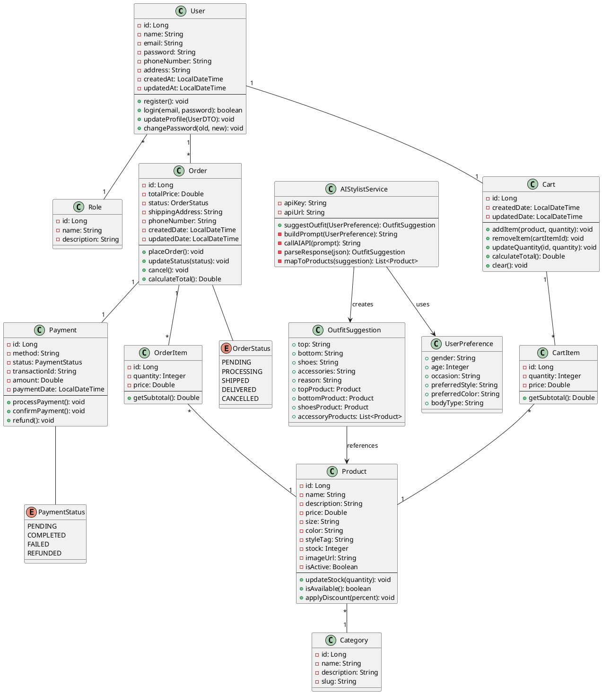

# 🏗 Class Diagram - Sơ Đồ Lớp

## Tổng Quan

Class Diagram mô tả cấu trúc các lớp trong hệ thống, bao gồm các thuộc tính, phương thức và mối quan hệ giữa chúng.

## 📦 Nhóm Class

### 1️⃣ User & Authentication
### 2️⃣ Product & Category
### 3️⃣ Shopping Cart
### 4️⃣ Order & Payment
### 5️⃣ AI Module

---

## 1️⃣ User & Authentication

### Class: User
```java
@Entity
@Table(name = "users")
public class User {
    // Attributes
    private Long id;
    private String name;
    private String email;
    private String password;
    private String phoneNumber;
    private String address;
    private Role role;
    private LocalDateTime createdAt;
    private LocalDateTime updatedAt;
    
    // Methods
    public void register();
    public boolean login(String email, String password);
    public void updateProfile(UserDTO userDTO);
    public void changePassword(String oldPassword, String newPassword);
}
```

**Thuộc tính:**
- `id`: Long - ID duy nhất
- `name`: String - Tên người dùng
- `email`: String - Email (unique)
- `password`: String - Mật khẩu đã mã hóa (BCrypt)
- `phoneNumber`: String - Số điện thoại
- `address`: String - Địa chỉ
- `role`: Role - Quyền (CUSTOMER/ADMIN)
- `createdAt`: LocalDateTime - Ngày tạo
- `updatedAt`: LocalDateTime - Ngày cập nhật

**Phương thức:**
- `register()`: Đăng ký tài khoản mới
- `login()`: Đăng nhập
- `updateProfile()`: Cập nhật thông tin
- `changePassword()`: Đổi mật khẩu

### Class: Role
```java
@Entity
@Table(name = "roles")
public class Role {
    private Long id;
    private String name; // CUSTOMER, ADMIN
    private String description;
}
```

**Relationship**: User **N:1** Role (Many users have one role)

---

## 2️⃣ Product & Category

### Class: Product
```java
@Entity
@Table(name = "products")
public class Product {
    // Attributes
    private Long id;
    private String name;
    private String description;
    private Double price;
    private String size;
    private String color;
    private String styleTag;
    private Integer stock;
    private String imageUrl;
    private Category category;
    private LocalDateTime createdAt;
    private LocalDateTime updatedAt;
    private Boolean isActive;
    
    // Methods
    public void updateStock(int quantity);
    public boolean isAvailable();
    public void applyDiscount(Double discountPercent);
}
```

**Thuộc tính:**
- `id`: Long - ID sản phẩm
- `name`: String - Tên sản phẩm
- `description`: String - Mô tả chi tiết
- `price`: Double - Giá bán
- `size`: String - Size (S, M, L, XL, XXL)
- `color`: String - Màu sắc
- `styleTag`: String - Tag phong cách (casual, formal, sporty, vintage...)
- `stock`: Integer - Số lượng tồn kho
- `imageUrl`: String - URL hình ảnh
- `category`: Category - Danh mục
- `isActive`: Boolean - Trạng thái hiển thị

**Phương thức:**
- `updateStock()`: Cập nhật tồn kho
- `isAvailable()`: Kiểm tra còn hàng
- `applyDiscount()`: Áp dụng giảm giá

### Class: Category
```java
@Entity
@Table(name = "categories")
public class Category {
    private Long id;
    private String name; // Áo, Quần, Giày, Phụ kiện
    private String description;
    private String slug;
}
```

**Relationship**: Product **N:1** Category (Many products belong to one category)

---

## 3️⃣ Shopping Cart

### Class: Cart
```java
@Entity
@Table(name = "carts")
public class Cart {
    private Long id;
    private User user;
    private List<CartItem> items;
    private LocalDateTime createdDate;
    private LocalDateTime updatedDate;
    
    // Methods
    public void addItem(Product product, int quantity);
    public void removeItem(Long cartItemId);
    public void updateQuantity(Long cartItemId, int quantity);
    public Double calculateTotal();
    public void clear();
}
```

**Phương thức:**
- `addItem()`: Thêm sản phẩm
- `removeItem()`: Xóa sản phẩm
- `updateQuantity()`: Cập nhật số lượng
- `calculateTotal()`: Tính tổng tiền
- `clear()`: Xóa giỏ hàng

### Class: CartItem
```java
@Entity
@Table(name = "cart_items")
public class CartItem {
    private Long id;
    private Cart cart;
    private Product product;
    private Integer quantity;
    private Double price;
    
    // Methods
    public Double getSubtotal();
}
```

**Relationships:**
- Cart **1:N** CartItem (One cart has many items)
- CartItem **N:1** Product (Many cart items reference one product)
- User **1:1** Cart (One user has one cart)

---

## 4️⃣ Order & Payment

### Class: Order
```java
@Entity
@Table(name = "orders")
public class Order {
    private Long id;
    private User user;
    private List<OrderItem> items;
    private Double totalPrice;
    private OrderStatus status;
    private String shippingAddress;
    private String phoneNumber;
    private Payment payment;
    private LocalDateTime createdDate;
    private LocalDateTime updatedDate;
    
    // Methods
    public void placeOrder();
    public void updateStatus(OrderStatus status);
    public void cancel();
    public Double calculateTotal();
}
```

**Thuộc tính:**
- `status`: OrderStatus - Trạng thái (PENDING, PROCESSING, SHIPPED, DELIVERED, CANCELLED)

**Phương thức:**
- `placeOrder()`: Đặt hàng
- `updateStatus()`: Cập nhật trạng thái
- `cancel()`: Hủy đơn
- `calculateTotal()`: Tính tổng

### Class: OrderItem
```java
@Entity
@Table(name = "order_items")
public class OrderItem {
    private Long id;
    private Order order;
    private Product product;
    private Integer quantity;
    private Double price;
    
    public Double getSubtotal();
}
```

### Enum: OrderStatus
```java
public enum OrderStatus {
    PENDING,      // Chờ xử lý
    PROCESSING,   // Đang xử lý
    SHIPPED,      // Đã gửi hàng
    DELIVERED,    // Đã giao
    CANCELLED     // Đã hủy
}
```

### Class: Payment
```java
@Entity
@Table(name = "payments")
public class Payment {
    private Long id;
    private Order order;
    private String method; // COD, VNPAY, MOMO, CREDIT_CARD
    private PaymentStatus status;
    private String transactionId;
    private Double amount;
    private LocalDateTime paymentDate;
    
    // Methods
    public void processPayment();
    public void confirmPayment();
    public void refund();
}
```

### Enum: PaymentStatus
```java
public enum PaymentStatus {
    PENDING,
    COMPLETED,
    FAILED,
    REFUNDED
}
```

**Relationships:**
- User **1:N** Order
- Order **1:N** OrderItem
- OrderItem **N:1** Product
- Order **1:1** Payment

---

## 5️⃣ AI Module

### Class: AIStylistService
```java
@Service
public class AIStylistService {
    private String apiKey;
    private String apiUrl;
    
    // Methods
    public OutfitSuggestion suggestOutfit(UserPreference userPreference);
    private String buildPrompt(UserPreference userPreference);
    private String callAIAPI(String prompt);
    private OutfitSuggestion parseResponse(String jsonResponse);
    private List<Product> mapToProducts(OutfitSuggestion suggestion);
}
```

**Phương thức:**
- `suggestOutfit()`: Gợi ý outfit chính
- `buildPrompt()`: Xây dựng prompt cho AI
- `callAIAPI()`: Gọi API AI
- `parseResponse()`: Parse JSON response
- `mapToProducts()`: Map với sản phẩm trong DB

### Class: UserPreference (DTO)
```java
public class UserPreference {
    private String gender;          // Nam/Nữ
    private Integer age;            // Tuổi
    private String occasion;        // Dịp (work, party, casual, sport)
    private String preferredStyle;  // Style yêu thích
    private String preferredColor;  // Màu ưa thích
    private String bodyType;        // Dáng người (optional)
}
```

### Class: OutfitSuggestion (DTO)
```java
public class OutfitSuggestion {
    private String top;         // Áo
    private String bottom;      // Quần/Váy
    private String shoes;       // Giày
    private String accessories; // Phụ kiện
    private String reason;      // Lý do gợi ý
    
    // Mapped products
    private Product topProduct;
    private Product bottomProduct;
    private Product shoesProduct;
    private List<Product> accessoryProducts;
}
```

---

## 🧩 PlantUML Code



## 📊 Relationships Summary

| Quan hệ | Mô tả | Cardinality |
|---------|-------|-------------|
| User - Role | User có một Role | N:1 |
| User - Cart | Mỗi User có một Cart | 1:1 |
| User - Order | User có nhiều Order | 1:N |
| Product - Category | Product thuộc một Category | N:1 |
| Cart - CartItem | Cart chứa nhiều CartItem | 1:N |
| CartItem - Product | CartItem tham chiếu Product | N:1 |
| Order - OrderItem | Order chứa nhiều OrderItem | 1:N |
| OrderItem - Product | OrderItem tham chiếu Product | N:1 |
| Order - Payment | Mỗi Order có một Payment | 1:1 |
| OutfitSuggestion - Product | Gợi ý map với Product | N:N |

## 🗂️ Database Tables

Từ Class Diagram, ta sẽ có các bảng sau:

1. `users` - Thông tin người dùng
2. `roles` - Vai trò người dùng
3. `categories` - Danh mục sản phẩm
4. `products` - Sản phẩm
5. `carts` - Giỏ hàng
6. `cart_items` - Chi tiết giỏ hàng
7. `orders` - Đơn hàng
8. `order_items` - Chi tiết đơn hàng
9. `payments` - Thanh toán

## 📝 Notes

1. **Password**: Luôn mã hóa bằng BCrypt trước khi lưu
2. **Price**: Sử dụng Double hoặc BigDecimal cho độ chính xác
3. **DateTime**: Sử dụng LocalDateTime (Java 8+)
4. **Soft Delete**: Có thể thêm trường `deletedAt` thay vì xóa thật
5. **Audit**: Thêm `createdBy`, `updatedBy` nếu cần audit trail

---

**[⬅️ Use Case Diagram](use-case-diagram.md)** | **[➡️ Sequence Diagram](sequence-diagram.md)**
