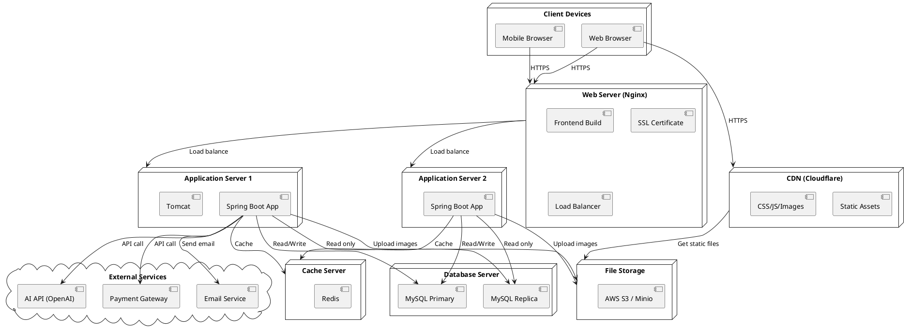

# 🧩 Component & Deployment Diagram

## Tổng Quan

Document này bao gồm:
1. **Component Diagram** - Cấu trúc các module/component
2. **Deployment Diagram** - Kiến trúc triển khai hệ thống

---

# 📦 COMPONENT DIAGRAM

## Tổng Quan
Component Diagram mô tả cấu trúc module của hệ thống và mối quan hệ giữa chúng.

## 🎯 System Architecture

### High-Level Architecture
```
┌──────────────────────────────────────────────┐
│            Frontend Layer                    │
│  ┌────────────────────────────────────────┐  │
│  │         React/Vue.js SPA              │  │
│  └────────────────────────────────────────┘  │
└──────────────────┬───────────────────────────┘
                   │ HTTPS/REST
┌──────────────────▼───────────────────────────┐
│           Backend Layer (Spring Boot)        │
│  ┌──────────┐  ┌──────────┐  ┌───────────┐  │
│  │   Auth   │  │ Product  │  │  Order    │  │
│  │  Module  │  │  Module  │  │  Module   │  │
│  └──────────┘  └──────────┘  └───────────┘  │
│  ┌──────────┐  ┌──────────┐                 │
│  │   Cart   │  │ AI Stylist│                 │
│  │  Module  │  │  Module   │                 │
│  └──────────┘  └──────────┘                 │
└──────────────────┬───────────────────────────┘
                   │
        ┌──────────┼────────────┐
        │          │            │
┌───────▼──┐  ┌───▼────┐  ┌───▼────────┐
│ Database │  │ AI API │  │  Payment   │
│  MySQL   │  │ External│  │  Gateway   │
└──────────┘  └────────┘  └────────────┘
```

## 🔷 Frontend Components

### PlantUML Code
```plantuml
@startuml

package "Frontend Layer" {
  
  [Web UI] as UI
  
  package "Pages" {
    [Home Page] as Home
    [Product List Page] as ProductList
    [Product Detail Page] as ProductDetail
    [Cart Page] as Cart
    [Checkout Page] as Checkout
    [AI Stylist Page] as AIStylist
    [Order History Page] as OrderHistory
    [Admin Dashboard] as Admin
  }
  
  package "Components" {
    [Header/Navigation] as Header
    [Product Card] as ProductCard
    [Cart Widget] as CartWidget
    [AI Stylist Form] as AIForm
    [Order Card] as OrderCard
  }
  
  package "Services" {
    [Auth Service] as AuthService
    [API Service] as APIService
    [Cart Service] as CartService
    [State Management] as Store
  }
  
  package "Utils" {
    [Validators] as Validators
    [Formatters] as Formatters
    [Constants] as Constants
  }
}

UIHome
Home --> Header
Home --> ProductCard
ProductList --> ProductCard
ProductDetail --> CartWidget
Cart --> CartWidget
Checkout --> APIService
AIStylist --> AIForm
Admin --> APIService

AuthService --> APIService
CartService --> Store
APIService --> Store

@enduml
```

### Frontend Tech Stack
- **Framework**: React 18.x / Vue 3.x
- **State Management**: Redux / Vuex / Pinia
- **Routing**: React Router / Vue Router
- **HTTP Client**: Axios
- **UI Library**: Material-UI / Ant Design / Tailwind CSS
- **Form Handling**: Formik / VeeValidate
- **Build Tool**: Vite / Webpack

---

## 🔷 Backend Components

### PlantUML Code
```plantuml
@startuml

package "Backend - Spring Boot" {
  
  package "API Layer" {
    [Auth Controller] as AuthCtrl
    [Product Controller] as ProductCtrl
    [Cart Controller] as CartCtrl
    [Order Controller] as OrderCtrl
    [AI Stylist Controller] as AICtrl
    [Admin Controller] as AdminCtrl
  }
  
  package "Service Layer" {
    [User Service] as UserService
    [Product Service] as ProductService
    [Cart Service] as CartService
    [Order Service] as OrderService
    [Payment Service] as PaymentService
    [AI Stylist Service] as AIService
    [Email Service] as EmailService
  }
  
  package "Repository Layer" {
    [User Repository] as UserRepo
    [Product Repository] as ProductRepo
    [Cart Repository] as CartRepo
    [Order Repository] as OrderRepo
    [Payment Repository] as PaymentRepo
  }
  
  package "Security" {
    [JWT Filter] as JWT
    [CORS Config] as CORS
    [Security Config] as Security
  }
  
  package "External Integration" {
    [AI API Client] as AIClient
    [Payment Gateway Client] as PaymentClient
    [Email Client] as EmailClient
  }
  
  package "Common" {
    [Exception Handler] as ExceptionHandler
    [Validators] as Validators
    [DTOs] as DTOs
    [Mappers] as Mappers
  }
}

package "Database" {
  database "MySQL" as DB
}

package "External Systems" {
  [AI API (OpenAI)] as AIExternal
  [Payment Gateway] as PaymentExternal
  [Email Service (SMTP)] as EmailExternal
}

' Controller -> Service
AuthCtrl --> UserService
ProductCtrl --> ProductService
CartCtrl --> CartService
OrderCtrl --> OrderService
OrderCtrl --> PaymentService
AICtrl --> AIService

' Service -> Repository
UserService --> UserRepo
ProductService --> ProductRepo
CartService --> CartRepo
OrderService --> OrderRepo
PaymentService --> PaymentRepo

' Service -> External
AIService --> AIClient
PaymentService --> PaymentClient
EmailService --> EmailClient

' Repository -> Database
UserRepo --> DB
ProductRepo --> DB
CartRepo --> DB
OrderRepo --> DB
PaymentRepo --> DB

' External Clients -> External Systems
AIClient --> AIExternal
PaymentClient --> PaymentExternal
EmailClient --> EmailExternal

' Security
JWT --> Security
CORS --> Security

@enduml
```

### Backend Tech Stack
- **Framework**: Spring Boot 3.x
- **Security**: Spring Security + JWT
- **ORM**: Spring Data JPA + Hibernate
- **Database**: MySQL 8.x
- **Validation**: JSR-380 (Bean Validation)
- **Documentation**: Swagger/OpenAPI
- **Build Tool**: Maven / Gradle

---

## 🔷 Module Details

### 1️⃣ Auth Module
**Responsibility**: Xác thực và phân quyền
```
├── AuthController
│   ├── POST /api/auth/register
│   ├── POST /api/auth/login
│   └── POST /api/auth/logout
├── UserService
│   ├── register(UserDTO)
│   ├── login(email, password)
│   └── validateToken(token)
└── JWTFilter
    └── Filter all requests
```

### 2️⃣ Product Module
**Responsibility**: Quản lý sản phẩm
```
├── ProductController
│   ├── GET /api/products
│   ├── GET /api/products/{id}
│   ├── GET /api/products/search
│   └── GET /api/products/filter
├── ProductService
│   ├── getAllProducts()
│   ├── getProductById(id)
│   ├── searchProducts(keyword)
│   └── filterProducts(criteria)
└── ProductRepository
    └── JPA Repository
```

### 3️⃣ Cart Module
**Responsibility**: Quản lý giỏ hàng
```
├── CartController
│   ├── GET /api/cart
│   ├── POST /api/cart/add
│   ├── PUT /api/cart/update
│   └── DELETE /api/cart/remove/{itemId}
├── CartService
│   ├── getCart(userId)
│   ├── addToCart(userId, productId, quantity)
│   ├── updateQuantity(itemId, quantity)
│   └── removeItem(itemId)
└── CartRepository
    └── JPA Repository
```

### 4️⃣ Order Module
**Responsibility**: Xử lý đơn hàng
```
├── OrderController
│   ├── POST /api/orders/checkout
│   ├── GET /api/orders
│   ├── GET /api/orders/{id}
│   └── PUT /api/orders/{id}/cancel
├── OrderService
│   ├── createOrder(orderDTO)
│   ├── getOrderHistory(userId)
│   ├── updateOrderStatus(orderId, status)
│   └── cancelOrder(orderId)
├── PaymentService
│   ├── processPayment(orderInfo)
│   ├── handleCallback(transactionId)
│   └── refund(orderId)
└── Repositories
    ├── OrderRepository
    └── PaymentRepository
```

### 5️⃣ AI Stylist Module ⭐
**Responsibility**: Tích hợp AI gợi ý phối đồ
```
├── AIStylistController
│   └── POST /api/ai/suggest-outfit
├── AIStylistService
│   ├── suggestOutfit(userPreference)
│   ├── buildPrompt(userPreference)
│   ├── callAIAPI(prompt)
│   ├── parseResponse(jsonResponse)
│   └── mapToProducts(suggestion)
└── AIAPIClient
    └── HTTP Client to OpenAI API
```

### 6️⃣ Admin Module
**Responsibility**: Quản trị hệ thống
```
├── AdminController
│   ├── Product Management
│   │   ├── POST /api/admin/products
│   │   ├── PUT /api/admin/products/{id}
│   │   └── DELETE /api/admin/products/{id}
│   ├── Order Management
│   │   ├── GET /api/admin/orders
│   │   └── PUT /api/admin/orders/{id}/status
│   └── User Management
│       ├── GET /api/admin/users
│       └── PUT /api/admin/users/{id}/status
└── @PreAuthorize("hasRole('ADMIN')")
```

---

# 🚀 DEPLOYMENT DIAGRAM

## Tổng Quan
Deployment Diagram mô tả cách triển khai hệ thống trên các node vật lý/cloud.

## 🏗 Production Deployment

### PlantUML Code


## 🌐 Deployment Architecture

### Option 1: AWS Deployment
```
Internet
    ↓
CloudFront (CDN)
    ↓
Route 53 (DNS)
    ↓
    ├─→ S3 (Static Frontend)
    ↓
Application Load Balancer
    ↓
    ├─→ EC2 Instance 1 (Backend)
    ├─→ EC2 Instance 2 (Backend)
    └─→ EC2 Instance 3 (Backend)
    ↓
    ├─→ RDS MySQL (Primary-Replica)
    ├─→ ElastiCache Redis
    └─→ S3 (Images/Files)
```

**Components:**
- **CloudFront**: CDN for static assets
- **S3**: Host frontend build + file storage
- **EC2 Auto Scaling Group**: Backend servers
- **RDS MySQL**: Managed database
- **ElastiCache Redis**: Session & cache
- **Elastic Load Balancer**: Distribute traffic

### Option 2: Self-Hosted (VPS)
```
Domain (GoDaddy/Namecheap)
    ↓
Cloudflare (CDN + SSL)
    ↓
VPS Server (DigitalOcean/Vultr)
    ├─→ Nginx (Reverse Proxy)
    ├─→ Docker Compose
    │   ├─→ Frontend Container
    │   ├─→ Backend Container (x2)
    │   ├─→ MySQL Container
    │   └─→ Redis Container
    └─→ Storage (Local/Minio)
```

### Option 3: Kubernetes (Advanced)
```
kubectl apply -f k8s/

Kubernetes Cluster
├─ Ingress Controller (Nginx)
├─ Frontend Deployment (3 replicas)
├─ Backend Deployment (5 replicas)
├─ MySQL StatefulSet
├─ Redis Deployment
└─ ConfigMaps & Secrets
```

---

## 📋 Server Specifications

### Development Environment
| Component | Spec | Notes |
|-----------|------|-------|
| Frontend Dev Server | 2 CPU, 4GB RAM | Vite/Webpack |
| Backend Dev Server | 2 CPU, 4GB RAM | Spring Boot |
| MySQL Dev | 1 CPU, 2GB RAM | Local database |
| Total | 5 CPU, 10GB RAM | |

### Testing/Staging Environment
| Component | Spec | Notes |
|-----------|------|-------|
| Web Server | 1 vCPU, 2GB RAM | Nginx |
| App Server | 2 vCPU, 4GB RAM | Spring Boot |
| Database | 2 vCPU, 4GB RAM | MySQL 8.x |
| Redis | 1 vCPU, 1GB RAM | Cache |
| Total | 6 vCPU, 11GB RAM | ~ $50-80/month |

### Production Environment (Small Scale)
| Component | Spec | Quantity | Notes |
|-----------|------|----------|-------|
| Load Balancer | 1 vCPU, 1GB | 1 | Nginx |
| App Server | 4 vCPU, 8GB | 2 | Auto-scale |
| Database Primary | 4 vCPU, 16GB, SSD | 1 | MySQL |
| Database Replica | 4 vCPU, 16GB, SSD | 1 | Read-only |
| Redis | 2 vCPU, 4GB | 1 | Cache/Session |
| Total | 19 vCPU, 53GB | | ~ $300-500/month |

### Production Environment (Large Scale)
| Component | Spec | Quantity | Notes |
|-----------|------|----------|-------|
| CDN | - | Global | Cloudflare/CloudFront |
| Load Balancer | Managed | 2 | HA setup |
| App Server | 8 vCPU, 16GB | 5-10 | Auto-scale |
| Database Cluster | 16 vCPU, 64GB | 3 | Master + 2 replicas |
| Redis Cluster | 4 vCPU, 8GB | 3 | HA setup |
| Total | - | | ~ $1000-2000/month |

---

## 🔧 DevOps Tools

### CI/CD Pipeline
```
GitHub/GitLab
    ↓
GitHub Actions / GitLab CI
    ↓
    ├─→ Build Frontend
    │   ├─→ npm run build
    │   └─→ Deploy to S3/CDN
    ↓
    └─→ Build Backend
        ├─→ mvn clean package
        ├─→ Build Docker image
        └─→ Deploy to EC2/K8s
```

### Monitoring & Logging
```
Application Logs
    ↓
    ├─→ ELK Stack (Elasticsearch, Logstash, Kibana)
    └─→ Loki + Grafana

Application Metrics
    ↓
    └─→ Prometheus + Grafana

Uptime Monitoring
    ↓
    └─→ UptimeRobot / Pingdom

Error Tracking
    ↓
    └─→ Sentry
```

### Tools List
- **Version Control**: Git + GitHub/GitLab
- **CI/CD**: GitHub Actions, GitLab CI, Jenkins
- **Containerization**: Docker, Docker Compose
- **Orchestration**: Kubernetes (optional)
- **Monitoring**: Prometheus, Grafana, ELK
- **Error Tracking**: Sentry
- **Backup**: Automated daily DB backup

---

## 🔒 Security Layers

### 1. Network Security
```
┌─────────────────────────────────────┐
│ Cloudflare (DDoS Protection)       │
└──────────────┬──────────────────────┘
               │
┌──────────────▼──────────────────────┐
│ WAF (Web Application Firewall)     │
└──────────────┬──────────────────────┘
               │
┌──────────────▼──────────────────────┐
│ Load Balancer (SSL Termination)    │
└──────────────┬──────────────────────┘
               │
┌──────────────▼──────────────────────┐
│ Application Server (Private VPC)   │
└──────────────┬──────────────────────┘
               │
┌──────────────▼──────────────────────┐
│ Database (Private Subnet)          │
└─────────────────────────────────────┘
```

### 2. Application Security
- **HTTPS/TLS 1.3** - All traffic encrypted
- **JWT Authentication** - Stateless auth
- **CORS** - Restrict origins
- **Rate Limiting** - Prevent abuse
- **Input Validation** - Prevent injection
- **SQL Injection Protection** - Prepared statements
- **XSS Protection** - Output encoding
- **CSRF Protection** - Token-based

### 3. Data Security
- **Encryption at Rest** - Database encryption
- **Encryption in Transit** - TLS
- **Password Hashing** - BCrypt
- **API Key Management** - Environment variables
- **Secrets Management** - AWS Secrets Manager / Vault
- **Regular Backups** - Daily automated backups
- **Access Control** - Role-based (RBAC)

---

## 📊 Scalability Strategy

### Horizontal Scaling
- Add more application servers behind load balancer
- Database read replicas for read-heavy operations
- Redis cluster for distributed caching

### Vertical Scaling
- Upgrade server specs (CPU, RAM)
- Optimize database queries
- Add indexes to frequently queried columns

### Caching Strategy
```
Request Flow:
User → Check Redis Cache
    ↓ Cache Miss
    → Query Database
    → Store in Redis (TTL: 1h)
    → Return to User
    
Cache Hit → Return from Redis
```

### Database Optimization
- **Indexing**: Add indexes on foreign keys, search columns
- **Query Optimization**: Use EXPLAIN to analyze queries
- **Connection Pooling**: HikariCP (default in Spring Boot)
- **Read Replicas**: Route read queries to replicas
- **Sharding**: Split data across multiple databases (future)

---

## 🔄 Backup & Recovery

### Backup Strategy
```
Daily Automated Backup
    ├─ Database Full Backup (2 AM)
    ├─ Incremental Backup (Every 6 hours)
    ├─ File Storage Backup (Daily)
    └─ Retention: 30 days
    
Backup Storage
    ├─ AWS S3 (Primary)
    └─ Off-site Storage (Secondary)
```

### Disaster Recovery Plan
1. **RTO (Recovery Time Objective)**: 4 hours
2. **RPO (Recovery Point Objective)**: 6 hours
3. **Failover**: Automatic to replica database
4. **Restore**: From latest backup

---

## 📝 Environment Variables

### Backend (.env)
```bash
# Database
DB_HOST=localhost
DB_PORT=3306
DB_NAME=fashion_db
DB_USERNAME=admin
DB_PASSWORD=***

# JWT
JWT_SECRET=***
JWT_EXPIRATION=86400000

# AI API
AI_API_URL=https://api.openai.com/v1
AI_API_KEY=***

# Payment
PAYMENT_GATEWAY_URL=***
PAYMENT_API_KEY=***

# Email
SMTP_HOST=smtp.gmail.com
SMTP_PORT=587
SMTP_USERNAME=***
SMTP_PASSWORD=***

# File Storage
S3_BUCKET=fashion-images
S3_ACCESS_KEY=***
S3_SECRET_KEY=***
```

### Frontend (.env)
```bash
VITE_API_URL=https://api.fashion-shop.com
VITE_CDN_URL=https://cdn.fashion-shop.com
VITE_GA_ID=UA-XXXXX-Y
```

---

**[⬅️ Activity Diagram](activity-diagram.md)** | **[➡️ System Architecture](system-architecture.md)**
