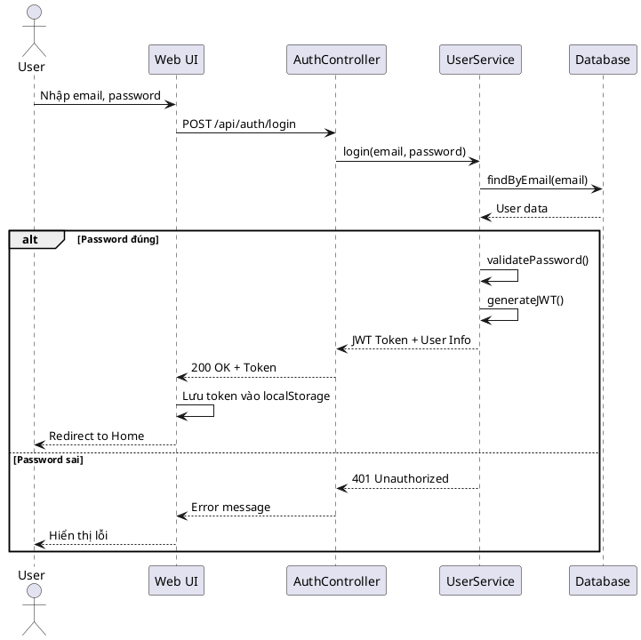
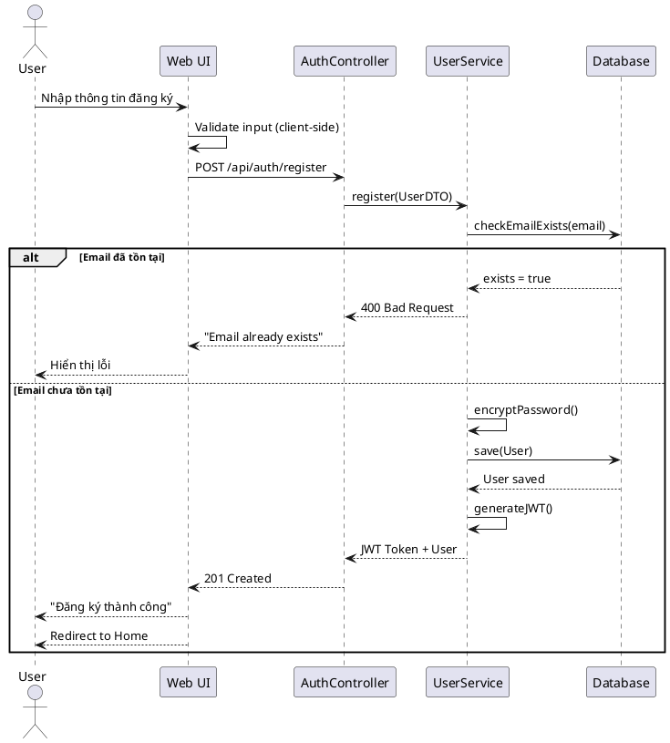
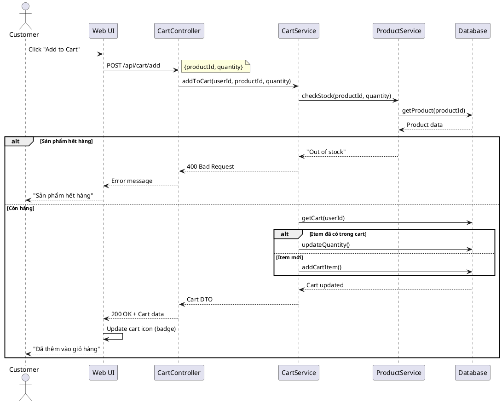
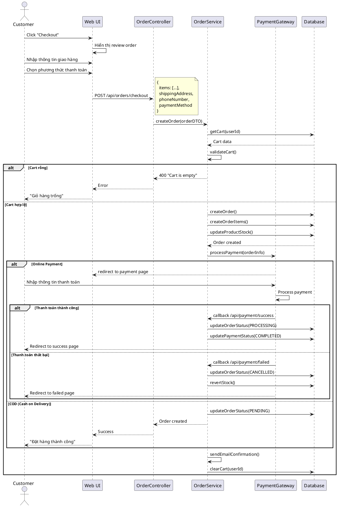
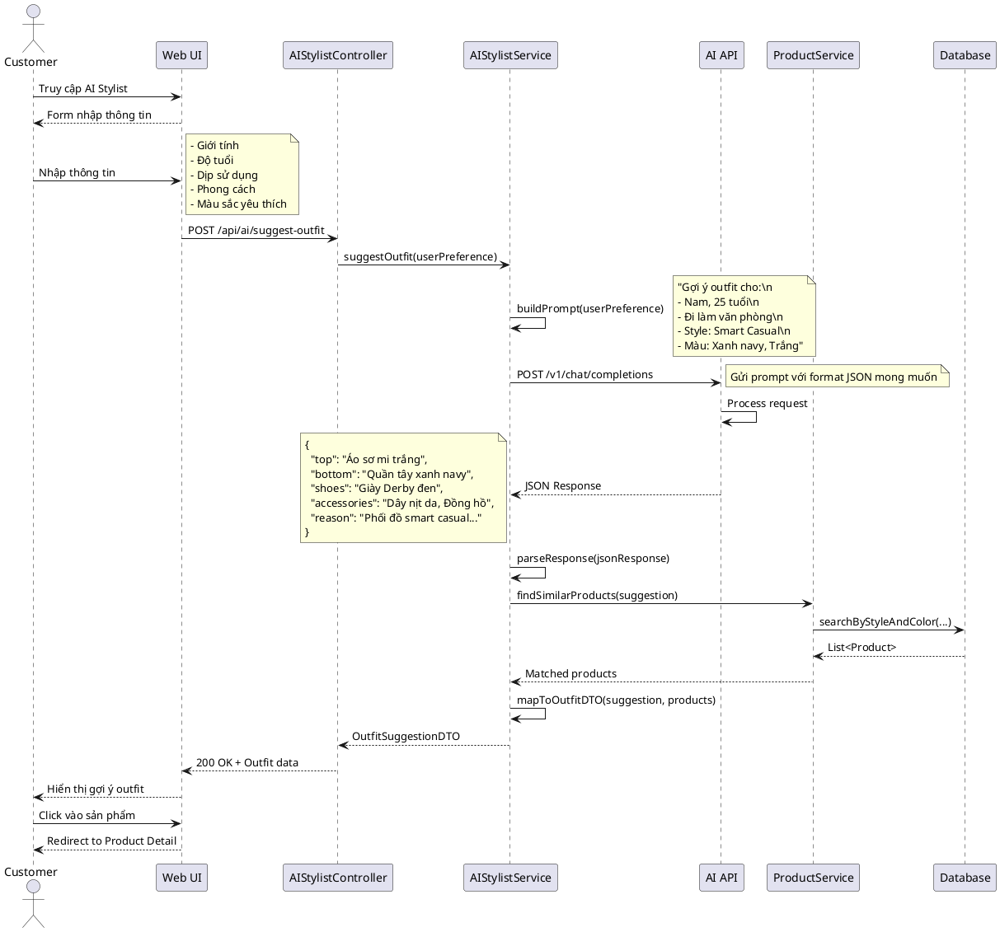
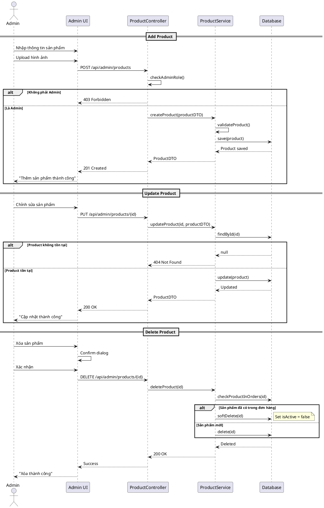

# 🔄 Sequence Diagram - Sơ Đồ Tuần Tự

## Tổng Quan

Sequence Diagram mô tả luồng xử lý và tương tác giữa các đối tượng theo trình tự thời gian.

## 📋 Danh Sách Sequence Diagrams

1. [🔐 User Login](#1-user-login)
2. [👤 User Registration](#2-user-registration)
3. [🛒 Add Product to Cart](#3-add-product-to-cart)
4. [💳 Checkout & Payment](#4-checkout--payment)
5. [🤖 AI Stylist Suggestion](#5-ai-stylist-suggestion) ⭐
6. [📦 Admin Manage Product](#6-admin-manage-product)

---

## 1️⃣ User Login

### Mô tả
Luồng đăng nhập của người dùng vào hệ thống.

### Actors
- Customer/Admin
- Web UI
- Backend API
- Database

### PlantUML Code


### Steps
1. User nhập email và password
2. UI gửi POST request đến `/api/auth/login`
3. Backend tìm user theo email
4. Validate password (BCrypt)
5. Nếu đúng: Tạo JWT token và trả về
6. Nếu sai: Trả về 401 Unauthorized
7. UI lưu token và redirect đến trang chủ

---

## 2️⃣ User Registration

### Mô tả
Luồng đăng ký tài khoản mới.

### PlantUML Code


### Business Rules
- Email phải unique
- Password tối thiểu 8 ký tự
- Tự động login sau khi đăng ký thành công

---

## 3️⃣ Add Product to Cart

### Mô tả
Thêm sản phẩm vào giỏ hàng.

### PlantUML Code


### Key Points
- Kiểm tra tồn kho trước khi thêm
- Nếu sản phẩm đã có trong cart → tăng quantity
- Update UI real-time (cart badge)

---

## 4️⃣ Checkout & Payment

### Mô tả
Luồng thanh toán đơn hàng (tích hợp Payment Gateway).

### PlantUML Code


### Steps
1. Customer review giỏ hàng
2. Nhập thông tin giao hàng
3. Chọn phương thức thanh toán
4. Backend tạo Order
5. Xử lý thanh toán qua Gateway (nếu online)
6. Cập nhật trạng thái Order & Payment
7. Gửi email xác nhận
8. Xóa giỏ hàng

---

## 5️⃣ AI Stylist Suggestion ⭐

### Mô tả
Luồng sử dụng AI để gợi ý phối đồ - Tính năng nổi bật của hệ thống.

### PlantUML Code


### Key Components

#### 1. Request DTO
```json
{
  "gender": "male",
  "age": 25,
  "occasion": "work",
  "preferredStyle": "smart-casual",
  "preferredColor": "navy, white"
}
```

#### 2. AI Prompt Template
```
Bạn là một fashion stylist chuyên nghiệp. 
Hãy gợi ý outfit hoàn chỉnh cho:
- Giới tính: {gender}
- Tuổi: {age}
- Dịp: {occasion}
- Phong cách yêu thích: {preferredStyle}
- Màu sắc yêu thích: {preferredColor}

Trả về JSON format:
{
  "top": "tên áo",
  "bottom": "tên quần/váy",
  "shoes": "tên giày",
  "accessories": "phụ kiện",
  "reason": "lý do gợi ý này"
}
```

#### 3. Response DTO
```json
{
  "outfit": {
    "top": {
      "suggestion": "Áo sơ mi trắng",
      "product": {
        "id": 123,
        "name": "Áo sơ mi Oxford trắng",
        "price": 450000,
        "imageUrl": "..."
      }
    },
    "bottom": {
      "suggestion": "Quần tây xanh navy",
      "product": {...}
    },
    "shoes": {...},
    "accessories": [...]
  },
  "reason": "Outfit này phù hợp cho môi trường công sở..."
}
```

### Business Logic
1. **Build Prompt**: Tạo prompt từ user input
2. **Call AI API**: Gửi request đến OpenAI/Custom AI
3. **Parse Response**: Parse JSON từ AI
4. **Product Matching**: 
   - Tìm sản phẩm tương tự trong DB
   - Match theo: category, color, styleTag
   - Sắp xếp theo độ phù hợp
5. **Return Result**: Trả về gợi ý + products

### Error Handling
- AI API timeout → Fallback to default suggestions
- No matching products → Suggest alternative
- Invalid AI response → Retry hoặc show error

---

## 6️⃣ Admin Manage Product

### Mô tả
Admin thêm/sửa/xóa sản phẩm.

### PlantUML Code


### Admin Authorization
```java
@PreAuthorize("hasRole('ADMIN')")
@PostMapping("/admin/products")
public ResponseEntity<?> createProduct(@RequestBody ProductDTO dto) {
    // Implementation
}
```

---

## 📊 Timing Considerations

| Sequence | Average Time | Notes |
|----------|-------------|-------|
| Login | 200-500ms | Include DB query + JWT generation |
| Registration | 300-600ms | Include password encryption |
| Add to Cart | 100-300ms | Fast operation |
| Checkout | 1-3s | Include payment gateway |
| AI Stylist | 3-10s | Depends on AI API response time |
| Admin CRUD | 200-500ms | Standard CRUD operations |

## 🔒 Security Notes

1. **JWT Token**: Expire sau 24h, refresh token sau 30 days
2. **Password**: BCrypt với cost factor = 12
3. **Payment**: Chỉ lưu transaction ID, không lưu card info
4. **AI API**: Rate limiting 10 requests/minute/user
5. **Admin**: Require 2FA cho sensitive operations

## 📝 Error Codes

| Code | Message | Description |
|------|---------|-------------|
| 400 | Bad Request | Invalid input |
| 401 | Unauthorized | Not authenticated |
| 403 | Forbidden | No permission |
| 404 | Not Found | Resource not found |
| 429 | Too Many Requests | Rate limit exceeded |
| 500 | Internal Server Error | Server error |

---

**[⬅️ Class Diagram](class-diagram.md)** | **[➡️ Activity Diagram](activity-diagram.md)**
