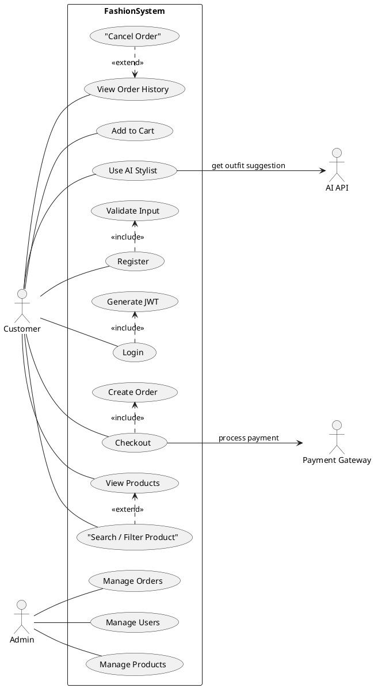

# 🎭 Use Case Diagram - Sơ Đồ Ca Sử Dụng

## Tổng Quan

Sơ đồ Use Case mô tả các chức năng chính của hệ thống và tương tác giữa các Actor với hệ thống.

## 🎭 Actors (Tác nhân)

### 1. 👤 Customer (Khách hàng)
Người dùng cuối sử dụng hệ thống để mua sắm thời trang và nhận gợi ý phối đồ từ AI.

### 2. 👨‍💼 Admin (Quản trị viên)
Người quản trị hệ thống, chịu trách nhiệm quản lý sản phẩm, đơn hàng và người dùng.

### 3. 🤖 AI API (External System)
Hệ thống AI bên ngoài cung cấp dịch vụ gợi ý phối đồ thông minh.

### 4. 💳 Payment Gateway (External System)
Cổng thanh toán bên thứ ba xử lý các giao dịch thanh toán online.

## 📌 Use Cases

### 👤 Customer Use Cases

#### UC-01: Register (Đăng ký)
- **Mô tả**: Khách hàng tạo tài khoản mới
- **Input**: Tên, email, mật khẩu
- **Output**: Tài khoản được tạo thành công
- **Quy trình**:
  1. Nhập thông tin đăng ký
  2. Validate dữ liệu (email duy nhất, mật khẩu mạnh)
  3. Mã hóa mật khẩu
  4. Lưu vào database

#### UC-02: Login (Đăng nhập)
- **Mô tả**: Đăng nhập vào hệ thống
- **Input**: Email, mật khẩu
- **Output**: JWT Token, thông tin người dùng
- **Quy trình**:
  1. Nhập email và mật khẩu
  2. Xác thực thông tin
  3. Tạo JWT token
  4. Redirect đến trang chủ

#### UC-03: View Products (Xem sản phẩm)
- **Mô tả**: Xem danh sách sản phẩm
- **Output**: Danh sách sản phẩm với thông tin: tên, giá, hình ảnh, size, màu

#### UC-04: Search / Filter Products (Tìm kiếm / Lọc sản phẩm)
- **Mô tả**: Tìm kiếm và lọc sản phẩm theo nhiều tiêu chí
- **Input**: 
  - Từ khóa tìm kiếm
  - Danh mục (áo, quần, giày...)
  - Khoảng giá
  - Size
  - Màu sắc
  - Style tag
- **Output**: Danh sách sản phẩm phù hợp

#### UC-05: Add to Cart (Thêm vào giỏ hàng)
- **Mô tả**: Thêm sản phẩm vào giỏ hàng
- **Input**: Product ID, số lượng
- **Output**: Sản phẩm được thêm vào cart
- **Business Rules**:
  - Kiểm tra tồn kho
  - Giới hạn số lượng tối đa

#### UC-06: Checkout (Thanh toán)
- **Mô tả**: Thanh toán đơn hàng
- **Input**: Thông tin giao hàng, phương thức thanh toán
- **Output**: Đơn hàng được tạo
- **Actors**: Customer, Payment Gateway
- **Quy trình**:
  1. Xác nhận giỏ hàng
  2. Nhập thông tin giao hàng
  3. Chọn phương thức thanh toán
  4. Redirect đến Payment Gateway
  5. Xử lý kết quả thanh toán
  6. Tạo đơn hàng
  7. Gửi email xác nhận

#### UC-07: View Order History (Xem lịch sử đơn hàng)
- **Mô tả**: Xem danh sách đơn hàng đã đặt
- **Output**: Danh sách đơn hàng với trạng thái: Pending, Processing, Shipped, Delivered, Cancelled

#### UC-08: Use AI Stylist (Sử dụng AI Stylist) ⭐
- **Mô tả**: Nhận gợi ý phối đồ từ AI
- **Input**: 
  - Giới tính
  - Độ tuổi
  - Phong cách ưa thích
  - Dịp sử dụng (đi làm, dự tiệc, đi chơi...)
  - Màu sắc yêu thích
- **Output**: 
  - Outfit suggestion (áo, quần, giày, phụ kiện)
  - Lý do gợi ý
  - Link đến sản phẩm tương ứng
- **Actors**: Customer, AI API
- **Quy trình**:
  1. Người dùng nhập thông tin
  2. Hệ thống build prompt
  3. Gọi AI API
  4. Parse kết quả JSON
  5. Map với sản phẩm trong DB
  6. Hiển thị gợi ý

### 👨‍💼 Admin Use Cases

#### UC-09: Manage Products (Quản lý sản phẩm)
- **Chức năng**:
  - ➕ Thêm sản phẩm mới
  - ✏️ Sửa thông tin sản phẩm
  - 🗑️ Xóa sản phẩm
  - 📦 Cập nhật tồn kho
- **Input**: Thông tin sản phẩm đầy đủ
- **Output**: CRUD operations thành công

#### UC-10: Manage Orders (Quản lý đơn hàng)
- **Chức năng**:
  - Xem danh sách đơn hàng
  - Cập nhật trạng thái đơn hàng
  - Xem chi tiết đơn hàng
  - Hủy đơn hàng

#### UC-11: Manage Users (Quản lý người dùng)
- **Chức năng**:
  - Xem danh sách người dùng
  - Khóa/Mở khóa tài khoản
  - Phân quyền
  - Xem lịch sử hoạt động

## 🧩 PlantUML Code

## 📊 Use Case Priority

### 🔴 High Priority (Phase 1)
- UC-02: Login
- UC-03: View Products
- UC-04: Search / Filter Products
- UC-05: Add to Cart
- UC-06: Checkout
- UC-09: Manage Products

### 🟡 Medium Priority (Phase 2)
- UC-01: Register
- UC-07: View Order History
- UC-08: Use AI Stylist ⭐
- UC-10: Manage Orders

### 🟢 Low Priority (Phase 3)
- UC-11: Manage Users
- Advanced filtering
- Statistics & Reports

## 🔄 Relationships

### Include
- **Register** include **Validate Input**
- **Login** include **Generate JWT**
- **Checkout** include **Create Order**

### Extend
- **Search / Filter Product** extend **View Products**
- **Cancel Order** extend **View Order History**

## 📝 Notes

1. **Use AI Stylist** là tính năng nổi bật, cần ưu tiên phát triển sau khi hoàn thành core features
2. Tích hợp Payment Gateway cần test kỹ trên sandbox trước khi production
3. Admin panel nên có dashboard với thống kê tổng quan
4. Xem xét thêm tính năng Wishlist, Review/Rating trong các phiên bản sau

---

**[⬅️ Quay lại](README.md)** | **[➡️ Class Diagram](class-diagram.md)**
